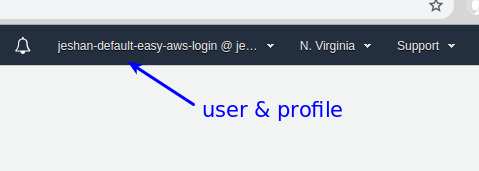

# easy-aws-login

The easiest way to log in to your AWS console. Get started by running `pip install easy-aws-login`

Leverages the existing `aws-cli` profiles that you've already set up.

Also clearly shows which profile (hence account) the user is in.

to login with your default credentials, type:
`easy-aws-login`

to login with a profile, type:
`easy-aws-login my-profile`

to login with a profile and change the default session duration of 12 hours (43200 seconds), type:
`easy-aws-login my-profile 7200`

## Deployment
This project is managed by AWS CodeBuild and the cloudformation template that drives it is found under [templates/deployment-pipeline.yaml](templates/deployment-pipeline.yaml). This is what a visualisation of it looks like:

